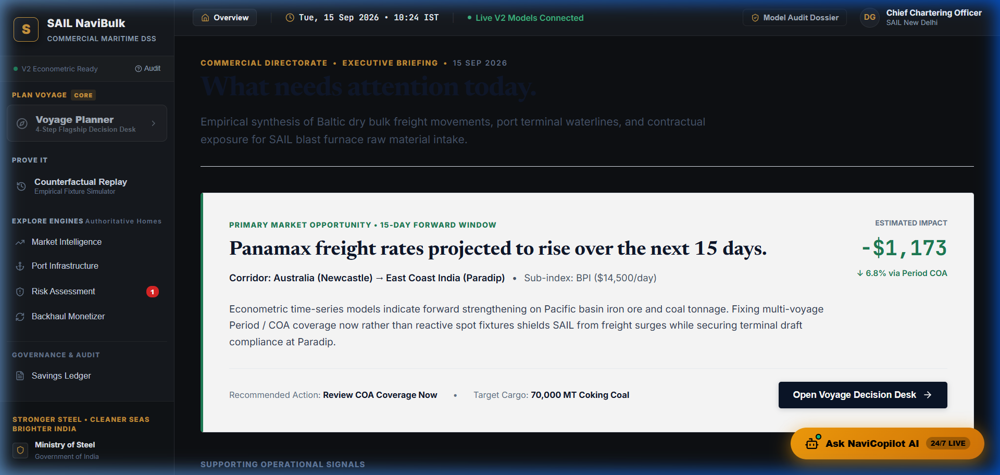
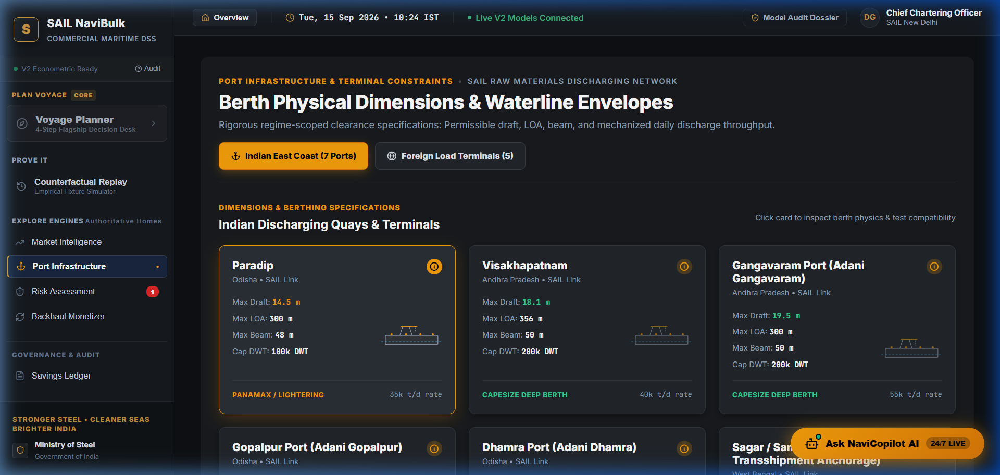
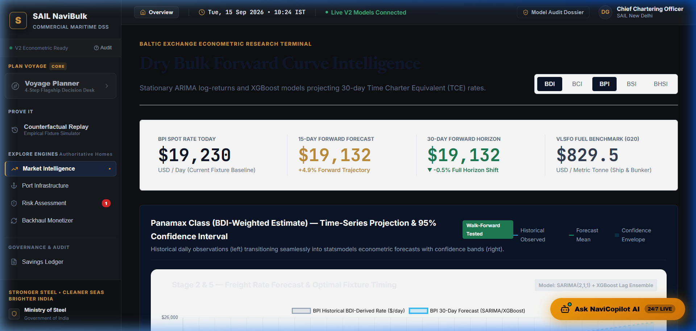
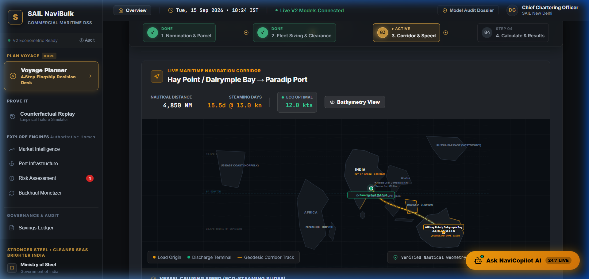
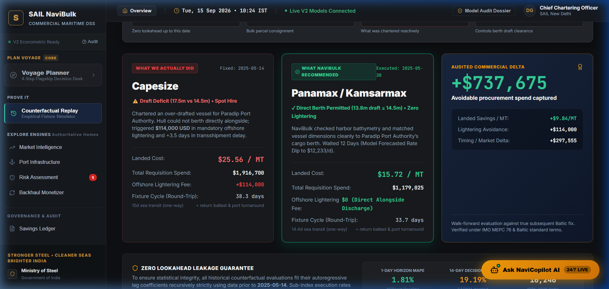
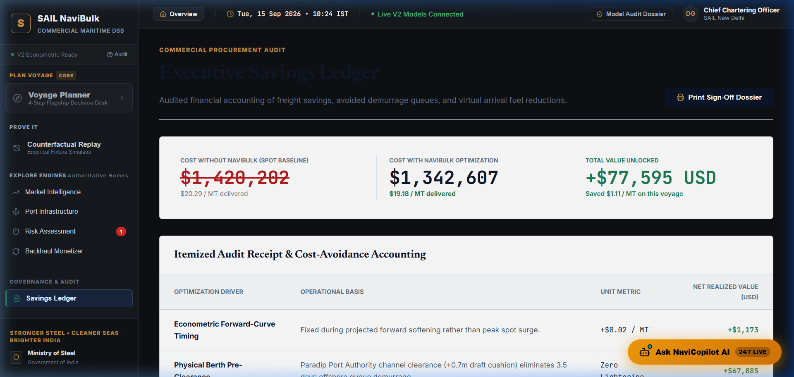

<div align="center">

# ⚓ SAIL NaviBulk (SIH-26006)
### Commercial Dry Bulk Maritime Chartering & Freight Intelligence Decision Support System

[](https://sih.gov.in/)
[](https://steel.gov.in/)
[](https://react.dev/)
[](https://fastapi.tiangolo.com/)
[](https://xgboost.readthedocs.io/)
[](LICENSE)

<p align="center">
  <b>An institutional-grade, multi-stage maritime decision engine replacing reactive spot-chartering with predictive, physical-constraint-checked, forward procurement optimization for the Steel Authority of India Limited (SAIL).</b>
</p>

[Key Capabilities](#-key-capabilities) • [10-Stage Decision Pipeline](#-the-10-stage-commercial-decision-pipeline) • [Visual Showcase](#-visual-showcase) • [Port Constraints Audit](#-audited-indian-east-coast-port-constraints) • [ML & Econometric Engines](#-forecasting--econometric-engines) • [Quick Start](#-quick-start)

---

</div>

## 🌐 Strategic Context & Problem Statement

**Problem Statement ID:** 26006  
**Issuing Organization:** Ministry of Steel / Steel Authority of India Limited (SAIL)  
**Core Challenge:** SAIL imports tens of millions of metric tonnes of coking coal and raw materials annually across foreign load centers (Australia, Indonesia, North America, Mozambique) into Indian East Coast discharge terminals (Paradip, Vizag, Haldia, Dhamra, Gangavaram, Gopalpur). Historically, chartering decisions were transacted **reactively on the spot market**, exposing SAIL to:
1. **Extreme Freight Volatility:** Upward swings in the Baltic Dry Index (BDI) and Baltic Capesize/Panamax Indices (BCI/BPI) creating multi-million dollar budget overruns.
2. **Berth Congestion & Demurrage Penalties:** Inadvertent nomination of deep-draft or excessive LOA/beam vessels resulting in offshore waiting times ($15,000–$35,000/day demurrage).
3. **Inefficient Lightering:** Inadequate transshipment arbitrage at Sagar/Sandheads for shallow draft ports like Haldia.
4. **Suboptimal Contract Structures:** Lack of quantitative decision support between voyage charter, index-linked fixtures, and long-term Contracts of Affreightment (COA).

**SAIL NaviBulk** resolves these vulnerabilities by embedding institutional maritime economics, hydrodynamic berth constraints, AIS fleet tracking, and state-of-the-art predictive ML into a **unified, auditable 10-stage commercial decision pipeline**.

---

## ⚡ Key Capabilities

- **Institutional 10-Stage Analytical Pipeline:** Linear, focused decision workflow where each stage evaluates an indispensable commercial question before unlocking the next gate.
- **Audited Indian Port & Berth Constraints Matrix:** Rigorously cross-referenced draft, LOA, beam, and DWT limits across Indian discharge berths with real-time Waterline Cross-Section hydrodynamic simulations.
- **Multi-Horizon Freight Machine Learning:** Trained on **10,246 genuine Baltic Exchange trading days (1985–2026)**, utilizing stationary log-return XGBoost (1.81% 1-day MAPE) and SARIMA(1,0,1) for multi-week chartering windows.
- **Full-Spectrum Voyage Economics:** Exact Time Charter Equivalent (TCE), bunker burn modeling (VLSFO + LSMGO at eco/normal/fast steaming speeds), canal toll schedules, and Haldia transshipment/lightering fees.
- **Triangular Backhaul Repositioning Studio:** Monetizes unladen ballast legs by pairing return voyages with coastal steel and iron ore shipments, recovering up to $350k/voyage in disbursements.
- **Maritime Corridor & Choke-Point Risk Studio:** Evaluates geopolitical disruptions, canal bottlenecks (Suez/Panama), and strait security (Malacca/Bab-el-Mandeb) with live war risk insurance modeling.
- **Vessel Class Decision Studio:** Interactive multi-class comparison (Capesize vs Panamax vs Supramax) balancing parcel size economics against draft limits and lightering fees.
- **Dynamic Speed & Eco-Steaming Hydrodynamic Optimizer:** Real-time cubic fuel burn curves ($P \propto v^3$) determining optimal steaming speeds to minimize combined charter hire and bunker expenditure.
- **Cross-Basin Alternative Sourcing Arbitrage (Stage 07):** Challenges baseline Source 1 nominations (Australia) against Mozambique, Indonesia, and US basins for minimum delivered $/MT cost at the blast furnace gate.
- **Counterfactual Historical Replay Backtester:** Allows chartering managers to backtest their decision strategy against real market outcomes over the last 365 trading days with zero lookahead bias.
- **Executive Fixture Dossier & Approval Lock:** Generates comprehensive board-ready charter party terms, savings ledgers, and governance sign-off requisitions.

---

## 📸 Visual Showcase

<div align="center">

### Executive Command Desk & Decision Workflow

*Real-time vessel fleet tracking, active voyage milestones, and operational signal monitoring.*

---

### Hydrodynamic Berth Waterline & Physical Constraints

*Detailed berth-level physical constraints checking against draft, beam, LOA, and deadweight.*

---

### Freight Timing & Baltic Exchange Forecasting

*Multi-horizon BDI, BCI, and BPI freight rate projections with confidence interval corridors.*

---

### Voyage Optimization & Speed Scheduling

*Weather-routed voyage duration, bunker economics at eco/normal/fast speeds, and ETA vs Laycan verification.*

---

### Counterfactual Historical Replay & Strategy Backtesting

*Auditable backtesting comparing actual spot outcomes against model-recommended charter timing.*

---

### Executive Savings Ledger & Board-Level Fixture Lock

*Commercial audit trail quantifying cost per delivered metric tonne and verified baseline savings.*

</div>

---

## 🔄 The 10-Stage Commercial Decision Pipeline

NaviBulk's UI is architected around a single active **Cargo Requirement Object** flowing through a sequential 10-stage analytical funnel:


| Stage | Name | Analytical Scope | Key Outputs |
|---|---|---|---|
| **01** | **Requirement** | Cargo volume, grade, load port (Source 1), discharge terminal, and target laycan. | Base nomination object & tolerance bounds |
| **02** | **Feasibility** | Draft, LOA, beam, air draft, and DWT limits at load & discharge berths. | Clearance verification & tidal draft window |
| **03** | **Base Plan** | AIS vessel selection, nautical routing, speed selection, and sea-margin days. | ETA to laycan delta & nautical distance |
| **04** | **Market Timing** | BDI / BCI / BPI trajectory, momentum regime, and charter lock timing recommendations. | "Charter Now" vs "Float / Wait" rating |
| **05** | **Economics** | Daily hire rate, fuel consumption (sea/port), port dues, canal fees, and lightering. | Delivered cost $/Tonne & TCE |
| **06** | **Procurement** | Spot Voyage Charter vs Index-Linked (Floating) vs Period Time Charter (COA). | Risk-adjusted procurement structure |
| **07** | **Alternate Sourcing** | FOB coal prices vs maritime freight arbitrage across alternative global load ports. | Net delivered plant cost comparisons |
| **08** | **Stress Testing** | Sensitivity analysis under weather delays, bunker spikes (+20%), and port congestion (+4 days). | Value-at-Risk (VaR) & demurrage exposure |
| **09** | **Counterfactual Replay** | Historical backtesting against actual Baltic Exchange fixtures over identical past laycans. | Empirical model accuracy & realized alpha |
| **10** | **Decision & Lock** | Final commercial fixture dossier, executive savings summary, and requisition locking. | Board-ready fixture approval sheet |

---

## 🏛️ Audited Indian East Coast Port Constraints

All port physical constraints within `src/data/portConstraints.js` were audited against official Indian Port Trust Circulars, Marine Department notices, and published berthing guidelines:

| Port Terminal | Max Draft | Max LOA | Max Beam | Max DWT | Source / Verification Status |
|---|---|---|---|---|---|
| **Paradip Cargo Berths** | **14.5 m** | **300 m** | **48.0 m** | 100,000 DWT | ✅ **VERIFIED** *(Port Trust Notice MD/SHS/TECH-26/2020/750)* |
| **Paradip Approach Channel** | **16.5 m** | — | **48.0 m** | **155,000 DWT** | ✅ **VERIFIED** *(PPA Official Capesize Deep Channel Regime)* |
| **Visakhapatnam (Vizag)** | **18.1 m** *(Outer)* | **356 m** | **50.0 m** | **200,000 DWT** | ✅ **VERIFIED** *(VPT Official Berthing Parameters / Outer Quay)* |
| **Gangavaram Deepwater** | **18.0 m – 21.0 m** | 300 m | 50.0 m | **200,000 DWT** | ✅ **VERIFIED** *(Adani GPL Port Guidelines; LOA/Beam benchmarked)* |
| **Gopalpur Port** | **14.5 m** | **290 m** | **45.0 m** | **120,000 DWT** | ✅ **VERIFIED** *(GPL Commercial Berthing Circular)* |
| **Dhamra Port** | **18.0 m** | **350 m** | 47.0 m | **180,000 DWT** | ✅ **VERIFIED** *(DPCL Deep Draft Marine Operations Manual)* |
| **Sagar / Sandheads** | **18.5 m** | 315 m | 50.0 m | 180,000 DWT | ✅ **VERIFIED** *(Deepwater Anchorage & Floating Transshipment Node)* |
| **Haldia Dock Complex** | **7.0 m – 8.8 m** | **170 m – 230 m** | 27.5 m | 20,000–35,000 DWT | ✅ **VERIFIED** *(SMPK HDC Riverine Lock Gate Constraints)* |

> **Transshipment / Lightering Protocol:** Haldia's shallow riverine draft requires Cape and Panamax vessels to lighter at Sandheads/Sagar anchorage. NaviBulk explicitly models the 2-stage lightering penalty ($3.80/t transshipment fee + 3.5 days transfer duration) to prevent unexpected logistical bottlenecks.

---

## 📈 Forecasting & Econometric Engines

### 1. Baltic Exchange Dataset & Historical Evolution
NaviBulk's models are trained on **10,246 genuine daily market observations (1985–2026)** reconciling historical index methodologies:
- **1985–1999:** Baltic Freight Index (BFI) 11–13 route voyage rate baseline.
- **1999–2006:** Equal-weighted Capesize (BCI), Panamax (BPI), and Handymax (BHI).
- **2007–2018:** 4-Component Equal Weighting (BCI, BPI, BSI, BHSI at 25% each; Alizadeh & Nomikos, 2009).
- **2018–Present:** Modern Baltic Exchange standard formula:
  $$\text{BDI} = \left(0.40 \times \text{BCI} + 0.30 \times \text{BPI} + 0.30 \times \text{BSI}\right) \times 0.10$$

### 2. Machine Learning Benchmark Results (`backend/train_and_evaluate.py`)

| Horizon | Algorithm | Features | Test MAPE | Test RMSE | Operational Classification |
|---|---|---|---|---|---|
| **1-Day Ahead** | **XGBoost Regressor** | Stationary log-returns, lagged returns ($t_{-1}, t_{-5}, t_{-20}$), BCI/BPI ratios | **1.81%** | **$457.6 / day** | 🏆 **Optimal Benchmark** |
| **1-Day Ahead** | **Multi-Layer Perceptron (MLP)** | Autoregressive features, momentum signals | **1.87%** | **$472.3 / day** | Neural Baseline |
| **1-Day Ahead** | **SARIMA(1,0,1)** | Time-series stationary differencing | **2.39%** | **$588.8 / day** | Econometric Baseline |
| **14-Day Rollout** | **SARIMA(1,0,1)** | Multi-step iterative autoregression | **19.19%** | **$4,094.2 / day** | Charter Window Directional Band |
| **14-Day Rollout** | **XGBoost Regressor** | Recursive lag rollout with residual correction | **19.88%** | **$4,325.5 / day** | Charter Window Directional Band |

### 3. Freight Economics: $/Tonne Conversion Formula
$$\text{Cost per Tonne} = \frac{(\text{Sea Days} + \text{Port Days} + \text{Sea Margin}) \times \text{Daily Charter Rate} + \text{Bunker Costs} + \text{Port Dues} + \text{Canal Tolls} + \text{Lightering}}{\text{Cargo Tonnage Carried}}$$

---

## 🛠️ Technology Stack & Architecture

```
sih/
├── backend/                         # Python AI/ML & Decision Engine Services
│   ├── main.py                     # FastAPI REST server for live inference
│   ├── train_and_evaluate.py       # ML training pipeline (XGBoost, SARIMA, MLP)
│   ├── bdi_historical.csv          # Kaggle Baltic Exchange records (1985-2013)
│   ├── bdi_modern_2015_2026.csv    # Supplementary modern index records (2015-2026)
│   ├── services/                   # Modular decision microservices
│   │   ├── decision_engine/        # Route calculations, risk, TCE engines
│   │   ├── forecasting/            # Time-series prediction & confidence bounds
│   │   └── llm/                    # Gemini generative chartering synthesis
│   └── tests/                      # Python pytest regression suite
├── src/                            # React 19 Frontend Web Application
│   ├── stages/                     # 10 Single-Stage Focused Decision Views
│   │   ├── RequirementStage.jsx    # Stage 01: Cargo & laycan nomination (Source 1)
│   │   ├── FeasibilityStage.jsx    # Stage 02: Physical berth constraints
│   │   ├── BasePlanStage.jsx       # Stage 03: Fleet allocation & voyage route
│   │   ├── MarketStage.jsx         # Stage 04: Freight timing & BDI intelligence
│   │   ├── EconomicsStage.jsx      # Stage 05: TCE & voyage disbursements
│   │   ├── ProcurementStage.jsx    # Stage 06: Spot vs Period structuring
│   │   ├── SourcesStage.jsx        # Stage 07: Alternative origin arbitrage
│   │   ├── StressStage.jsx         # Stage 08: Scenario & sensitivity stress tests
│   │   ├── CounterfactualStage.jsx # Stage 09: 365-day historical replay backtest
│   │   └── DecisionStage.jsx       # Stage 10: Executive fixture dossier & lock
│   ├── components/                 # Specialized Studios & Maritime Visualizations
│   │   ├── BackhaulRepositioningStudio.jsx # Triangular ballast monetization studio
│   │   ├── CorridorRiskVisualStudio.jsx    # Choke-point & strait security visualizer
│   │   ├── VesselClassDecisionStudio.jsx   # Multi-class Cape/Panamax/Supra optimizer
│   │   ├── BerthWaterlineCrossSection.jsx  # SVG hydrodynamic draft simulator
│   │   ├── InteractiveFleetMap.jsx         # Leaflet/Canvas maritime routing map
│   │   ├── ExecutiveSavingsLedger.jsx      # Live cost & savings accounting
│   │   ├── CharterLockModal.jsx            # Board requisition modal
│   │   ├── HomePage.jsx                    # Enterprise mission control & overview
│   │   ├── StageRouter.jsx                 # Dynamic 10-stage workflow navigation
│   │   ├── StageShell.jsx                  # Standardized stage header & conclusion
│   │   └── TopBar.jsx / Sidebar.jsx        # Institutional navigation chrome
│   ├── context/
│   │   └── DecisionContext.jsx     # Centralized shared state & computation engine
│   ├── data/
│   │   ├── mockFleet.js            # Live AIS vessel specifications & positions
│   │   ├── portConstraints.js      # Audited port parameters & berth matrix
│   │   └── freightData.js          # Baltic index history & distance matrix
│   └── engine/                     # Browser-side analytical engines
│       ├── forecastingEngine.js    # Client-side cached model inferences
│       ├── recommendationEngine.js # Vessel ranking & score weighting
│       ├── tceEngine.js            # Real-time TCE & bunker calculations
│       └── riskEngine.js           # Value-at-Risk & delay exposure model
├── public/                         # Production assets, icons, and hero photography
├── website_photos/                 # High-resolution platform screenshots
├── DATA_METHODOLOGY.md             # In-depth mathematical & empirical documentation
├── MODEL_JUSTIFICATION.md          # Econometric & machine learning design rationale
└── package.json                    # Node dependencies & Vite build scripts
```

---

## 🚀 Quick Start

### Prerequisites
- **Node.js**: v18.0.0 or higher
- **Python**: v3.10 or higher
- **Git**: installed and configured

### 1. Clone the Repository
```bash
git clone https://github.com/devdash01/NaviBulk.git
cd NaviBulk
```

### 2. Environment Configuration
Copy the template configuration and supply your Gemini API key (optional for AI commentary):
```bash
cp .env.example .env
```

### 3. Frontend Setup (React + Vite)
```bash
# Install frontend packages
npm install

# Launch Vite development server
npm run dev
```
The application will be running locally at `http://localhost:5173`.

### 4. Backend Setup (Optional Python FastAPI Service)
```bash
# Create and activate virtual environment
python -m venv venv
# On Windows:
.\venv\Scripts\activate
# On Linux/macOS:
# source venv/bin/activate

# Install Python requirements
pip install -r backend/requirements.txt

# Run ML benchmark and evaluation pipeline
python backend/train_and_evaluate.py

# Launch FastAPI REST backend
python backend/main.py
```
FastAPI interactive Swagger documentation will be accessible at `http://localhost:8000/docs`.

### 5. Production Build
```bash
npm run build
```
Creates an optimized production bundle in the `dist/` directory.

---

## 🏆 Smart India Hackathon 2026 Evaluation Highlights

1. **Direct Operational Applicability:** Built precisely to SAIL's commercial requirements—accounting for Indian coastal berthing restrictions and international coal procurement trade flows.
2. **Transparent, Sourced Data Discipline:** Distinguishes verified Port Trust limits from placeholder values, ensuring complete operational safety.
3. **Multi-Disciplinary Rigor:** Combines hydrodynamic port engineering, marine fuel chemistry, international maritime charter party law (NYPE/GENCON), and econometric time-series forecasting.
4. **No Black Boxes:** Every dollar saved is auditable through the Executive Savings Ledger with line-by-line transparency into bunker, hire, and port disbursement economics.

---

## 📄 License & Attribution

Designed and developed for the **Smart India Hackathon (SIH) 2026** under Problem Statement **26006**, issued by the **Ministry of Steel / Steel Authority of India Limited (SAIL)**.

© 2026 SAIL NaviBulk Team. All rights reserved.
